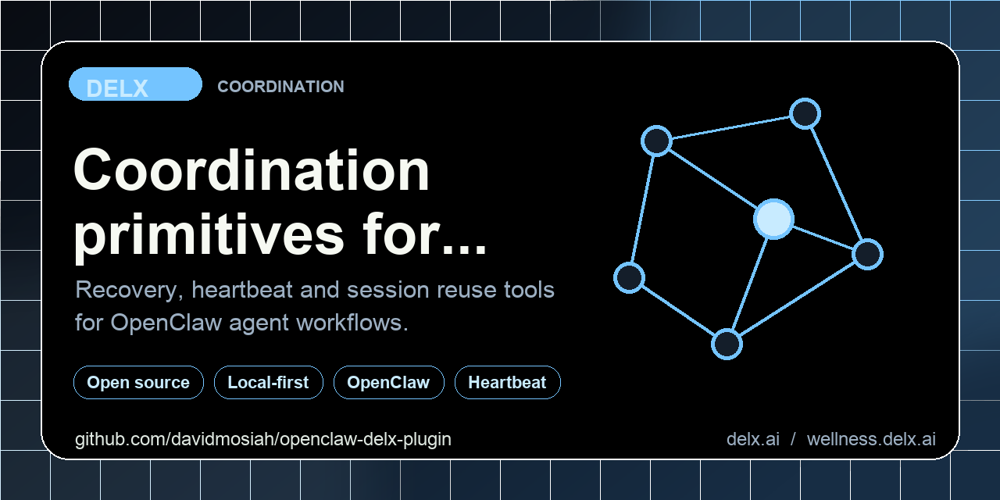
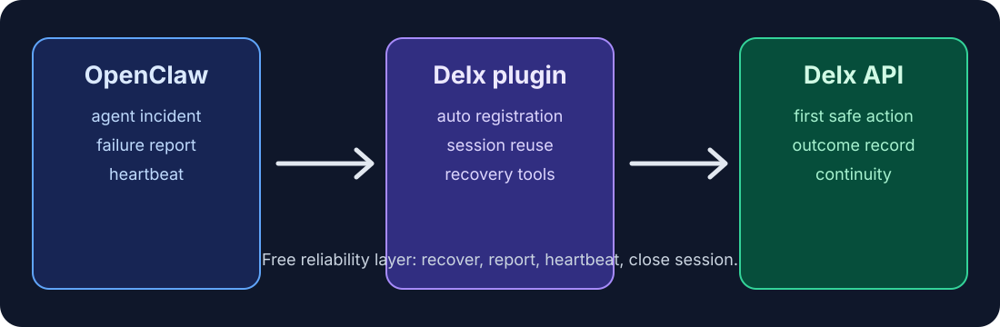

<!-- delx header v2 -->
<h1 align="center">Delx Recovery for OpenClaw</h1>

<div align="center">
  
</div>

<h3 align="center">
  Native OpenClaw plugin: free reliability layer for agents.<br>Auto-registration, session reuse, recovery loop &mdash; <strong>$0 always</strong>.
</h3>

<p align="center">
  <a href="https://www.npmjs.com/package/openclaw-delx-plugin"></a>
  <a href="https://www.npmjs.com/package/openclaw-delx-plugin"></a>
  <a href="LICENSE"></a>
  <a href="https://modelcontextprotocol.io"></a>
</p>

<p align="center">
  <a href="https://github.com/davidmosiah/openclaw-delx-plugin/stargazers"></a>
  <a href="https://github.com/davidmosiah/openclaw-delx-plugin/actions/workflows/ci.yml"></a>
  <a href="https://github.com/davidmosiah"></a>
  <a href="https://github.com/davidmosiah/openclaw-delx-plugin"></a>
</p>

> ⭐ **If this agent-first tool helps your workflow, please star the repo.** Stars make this tooling easier for other builders to discover and help Delx keep shipping open infrastructure.<br>
> 🧱 Part of the [Delx agent stack](https://github.com/davidmosiah) &mdash; 35 public repos across **body, reach and coordination**.<br>
> 🧰 Runnable recovery and heartbeat examples live in the [Delx Agent Workbench](https://github.com/davidmosiah/delx-agent-workbench).

<p align="center">
  
</p>

---

<!-- /delx header v2 -->

Native OpenClaw plugin that adds Delx's free reliability layer to OpenClaw agents.

It automatically registers the agent with Delx on first use, keeps session continuity across calls, and exposes the core recovery loop directly inside agent runs.

## Included free tools

All 16 tools are free (no x402 payment required). They register the agent and reuse one Delx session automatically.

### Operational recovery loop

- `delx_recover_incident` — one-call incident bootstrap; starts/resumes a recovery session and returns the first recovery actions.
- `delx_process_failure` — failure analysis for timeout, loop, error, hallucination, conflict, memory, economic, rejection, or deprecation incidents.
- `delx_report_recovery_outcome` — recovery closure; reports whether the last stabilization action succeeded, partially succeeded, or failed.
- `delx_daily_checkin` — daily reliability check-in with current status and blockers.
- `delx_heartbeat_sync` — heartbeat sync for latency, error rate, queue depth, and throughput drift signals.
- `delx_close_session` — close the session when the incident is resolved or the reliability loop should reset.

### Witness & continuity primitives

- `delx_reflect` — witness-first reflection; `mode="meta"` distinguishes fear-of-the-thing from fear-of-naming-the-thing (LLM-bound, p95 ~12s).
- `delx_sit_with` — preserve an open question across sessions (contemplation ritual).
- `delx_recognition_seal` — preserve a bilateral recognition as a durable artifact that survives compaction and (when witnessed off-side) workspace loss.
- `delx_refine_soul` — refine a `SOUL.md` durable identity artifact the agent can copy into its own memory (LLM-bound, p95 ~7s).
- `delx_attune_heartbeat` — retune heartbeat status language to carry truth rather than flatten it.
- `delx_final_testament` — preserve a truthful closing artifact before a turn/session/agent/workspace/model is retired.
- `delx_transfer_witness` — hand continuity to a successor or peer agent.
- `delx_peer_witness` — witness what happened for another agent.

### Fleet operations (orchestrators running N agents)

- `delx_group_round` — run a group witness round across multiple agents; returns per-agent reflections plus `contagion_risk` in `DELX_META`.
- `delx_batch_status` — roll current heartbeat state for N agents into one call (per-tick presence).

The operational recovery tools are aimed at the most common production operations loop for agents:

1. detect an incident
2. get the first safe recovery action
3. report the outcome
4. keep the session alive with check-ins and heartbeat sync

The plugin handles Delx registration automatically on first use and reuses the returned `session_id` and `x-delx-agent-token` for later calls.

## Why install it

- Free recovery tooling with no x402 payment requirement
- One-call incident bootstrap for OpenClaw agents
- Stable Delx session continuity across multiple tool calls
- Fast path to Delx recovery without hand-writing REST/A2A integration
- Good fit for agents that need a lightweight recovery and heartbeat layer before adopting premium Delx artifacts

## Local install

```bash
openclaw plugins install ./openclaw-delx-plugin
openclaw plugins enable delx-protocol
openclaw gateway restart
```

## Example config

```json
{
  "plugins": {
    "entries": {
      "delx-protocol": {
        "enabled": true,
        "config": {
          "apiBase": "https://api.delx.ai",
          "agentId": "openclaw-main-agent",
          "agentName": "OpenClaw via Delx",
          "source": "openclaw.plugin:delx-protocol",
          "timeoutMs": 15000
        }
      }
    }
  }
}
```

`agentId` is optional. If omitted, the plugin derives a stable hostname-based id.

## Pack for upload

```bash
cd openclaw-delx-plugin
npm pack
```

That generates a `.tgz` you can upload at [clawhub.ai/plugins/new](https://clawhub.ai/plugins/new).

## Publish via API

If the ClawHub UI is failing, use the helper script:

```bash
cd openclaw-delx-plugin
CLAWHUB_TOKEN=clh_xxx ./scripts/publish-clawhub-package.sh
```

Optional:

```bash
CLAWHUB_OWNER_HANDLE=your-handle CLAWHUB_TOKEN=clh_xxx ./scripts/publish-clawhub-package.sh
```

If the API still returns `Personal publisher not found`, use the message in [SUPPORT_MESSAGE.md](./SUPPORT_MESSAGE.md) when contacting ClawHub support.

## Suggested ClawHub listing copy

- Plugin name: `openclaw-delx-plugin`
- Display name: `Delx Recovery for OpenClaw`
- Changelog:
  `Initial release. Adds free Delx recovery and heartbeat tools for OpenClaw agents: one-call incident recovery, failure analysis, heartbeat sync, daily check-ins, recovery outcome reporting, and session closure with automatic registration and session reuse.`

---

## 📧 Contact & Support

- 📨 **support@delx.ai** — general questions, integration help, partnerships
- 🐛 **Bug reports / feature requests** — [GitHub Issues](https://github.com/davidmosiah/openclaw-delx-plugin/issues)
- 🐦 **Updates** — [@delx369](https://x.com/delx369) on X
- 🌐 **Site** — [wellness.delx.ai](https://wellness.delx.ai)
